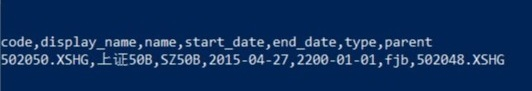
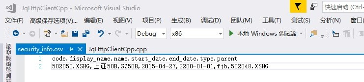

# 聚宽数据Http服务客户端C++接口示例

<!-- TOC -->

- [聚宽数据Http服务客户端C++接口示例](# 聚宽数据Http服务客户端C++接口示例)
    - [环境准备](##环境准备)
    - [获取token示例](##获取token示例)
    - [获取标的信息示例](##获取标的信息示例)
    - [读写标的信息到CSV文件示例](##读写标的信息到CSV文件示例)
    - [完整代码示例](##完整代码示例) 

<!-- /TOC -->

## 1. 环境准备

配置Visual Studio 2017 使用微软的C++ REST SDK, 具体过程请参考此文档  https://github.com/Microsoft/cpprestsdk.

## 2. 建立一个空的【控制台应用程序】, 引用以下头文件和命名空间： 

```c++
#include "stdafx.h"
#include <string>
#include <cpprest/http_client.h>

using namespace std;
using namespace jq_cpp_client;
```

## 3. 获取token示例

```c++
const std::string url = "https://dataapi.joinquant.com/apis"; // JqData 接口地址
const std::string mob = "XXXXXX"; //mob是申请JQData时所填写的手机号
const std::string pwd = "XXXXXX";

//创建一个聚宽http client实例
CJoinQuantCPP client(url);
// 获取 token
string token = client.get_token(url, mob, pwd);

```

正常获得token后的输入如下：


|           |                       |
| --------- | --------------------- |
| 名称      | 解释                  |
| get_token | 方法名                |
| url       | 参数，JqData接口地址  |
| mob       | 注册JqData时的手机号  |
| pwd       | 注册JqData时的密码    |
| 返回值    | 字符串格式的 token 值 |


## 4. 获取标的信息示例

```c++
	string security_info = client.get_price(string("502050.XSHG"));
```

代码输出为：



|           |                       |
| --------- | --------------------- |
| 名称      | 解释                  |
| get_price | 方法名                |
| code       | 参数，证券代码的字符串  |
| 返回值    | 字符串格式标的信息 |


## 5. 读写标的信息到CSV文件示例

由于CSV文件是一种按逗号分隔的文本格式，所以，JqData返回的标的信息符合这种要求，可以直接以文本的格式写入CSV文件中。

```c++
/// <summary>
/// 将标的信息写入CSV文件中
/// </summary>
/// <param name="info">标的信息</param>
/// <param name="filename">文件路径</param>
static void save_csv(string info, string filename)
{
    ofstream outFile;
    outFile.open(filename, ios::out);
    outFile << info;
    outFile.close();
}

/// <summary>
/// 将CSV中的信息按文本读取
/// </summary>
/// <param name="filename"></param>
/// <returns></returns>
static string  read_csv(string filename)
{
    ifstream inFile(filename);
    ostringstream info;

    string line;
    while (getline(inFile, line)) {
        info << line << endl;
    }
    return info.str();
}
```

本例直接将文件写入到程序根目录下，打开后效果如下：



|           |                       |
| --------- | --------------------- |
| 名称      | 解释                  |
| save_csv | 方法名                |
| info | 从JqData获得的标的信息                            |
| filename | 保存的文件名称，也就是文件地址，后缀必须是csv格式 |

从文件读取后的输出为：


|           |                       |
| --------- | --------------------- |
| 名称      | 解释                  |
| read_csv | 方法名                |
| filename | 参数 保存的文件名称，也就是文件地址，后缀必须是csv格式 |


### 建议：
在我运行的Windows 10环境， Visual Studio 17 项目默认字符集是"使用Unicode字符集" (代码页 65001)， 而Windowns 控制台默认字符集是GBK (代码页 936), 因此控制台显示的中文字符是乱码。 解决方法如下：
先用有管理员权限的用户打开一个控制台， 输入chcp 65001，这样把当前控制台的字符集临时改为UTF-8.


## 6. 完整代码示例

```c++
#include "stdafx.h"
#include <string>
#include <cpprest/http_client.h>

using namespace std;

namespace  jq_cpp_client
{
	using namespace web;                        // Common features like URIs.
	using namespace web::http;                  // Common HTTP functionality
	using namespace web::http::client;          // HTTP client features

#define VERIFY_IS_TRUE(expression, ...) CHECK_EQUAL(true, expression, ##__VA_ARGS__)

	class CJoinQuantCPP
	{
	public:
		CJoinQuantCPP(string url) :m_client(utility::conversions::to_utf16string(url)) {};
		CJoinQuantCPP() : m_client(L"https://dataapi.joinquant.com/apis") {};
		~CJoinQuantCPP() {};

		string get_token(std::string url, std::string mob, std::string pwd)
		{

			json::value json_query;
			json_query[L"method"] = json::value::string(U("get_token"));
			json_query[L"mob"] = json::value::string(utility::conversions::to_string_t(mob));
			json_query[L"pwd"] = json::value::string(utility::conversions::to_string_t(pwd));

			m_client = http_client(utility::conversions::to_utf16string(url));
			utility::string_t path = utility::string_t(U("/"));

			auto rsp = _make_request(methods::POST, path, json_query);
			return rsp.then([&](http_response rsp) {
				m_token = _check_response(rsp);
				return m_token;
			}).get();

		}

		string get_price(std::string code)
		{
			json::value json_query;
			json_query[L"method"] = json::value::string(U("get_security_info"));
			json_query[L"token"] = json::value::string(utility::conversions::to_string_t(m_token));
			json_query[L"code"] = json::value::string(utility::conversions::to_string_t(code));

			utility::string_t path = utility::string_t(U("/"));

			auto rsp = _make_request(methods::POST, path, json_query);
			return rsp.then([&](http_response rsp) {
				return _check_response(rsp);
			}).get();
		}

		static void save_csv(string info, string filename)
		{
			ofstream outFile;
			outFile.open(filename, ios::out);
			outFile << info;
			outFile.close();
		}

		static string  read_csv(string filename)
		{
			ifstream inFile(filename);
			ostringstream info;

			string line;
			while (getline(inFile, line)) {
				info << line << endl;
			}
			return info.str();
		}

	private:

		web::http::client::http_client m_client;
		string m_token;

		pplx::task<web::http::http_response>  _make_request(web::http::method method,
			const utility::string_t& path,
			const web::json::value& data)
		{
			web::http::uri_builder bldr;
			bldr.append(path);

			web::http::http_request req(method);
			req.set_request_uri(bldr.to_string());
			req.set_body(data);
			return _make_request(req);
		}

		pplx::task<web::http::http_response>  _make_request(web::http::http_request req)
		{
			return m_client.request(req);
		}

		string _check_response(web::http::http_response rsp) {
			if (rsp.status_code() == status_codes::ServiceUnavailable)
			{
				return string("ServiceUnavailable");
			}

			if (rsp.status_code() == status_codes::NotImplemented)
			{
				return string("Method Not Implemented");
			}

			if (rsp.status_code() == status_codes::OK)
			{
				//rsp.content_ready().wait();
				return rsp.extract_utf8string().get();
			}
			return string("Unknow Error");
		}
	};
}//namespace jq_cpp_client

using namespace jq_cpp_client;

int main()
{
	const std::string url = "https://dataapi.joinquant.com/apis";
	const std::string mob = "XXXXXX";
	const std::string pwd = "XXXXXX";

	CJoinQuantCPP client(url);
	// 获取 token
	string token = client.get_token(url, mob, pwd);
	cout << token << endl;

	// 获取标的的价格信息
	string security_info = client.get_price(string("502050.XSHG"));
	cout << security_info << endl;

	//写文件
	string file_name = "security_info.csv";
	client.save_csv(security_info, file_name);

	//读文件
	string text = client.read_csv(file_name);
	cout << text;

	return 0;
}                    
```